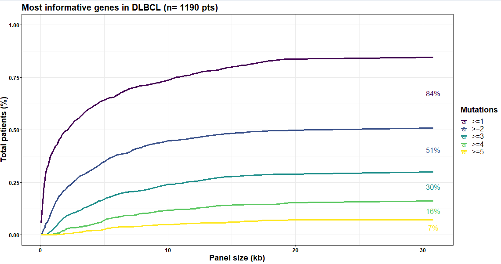
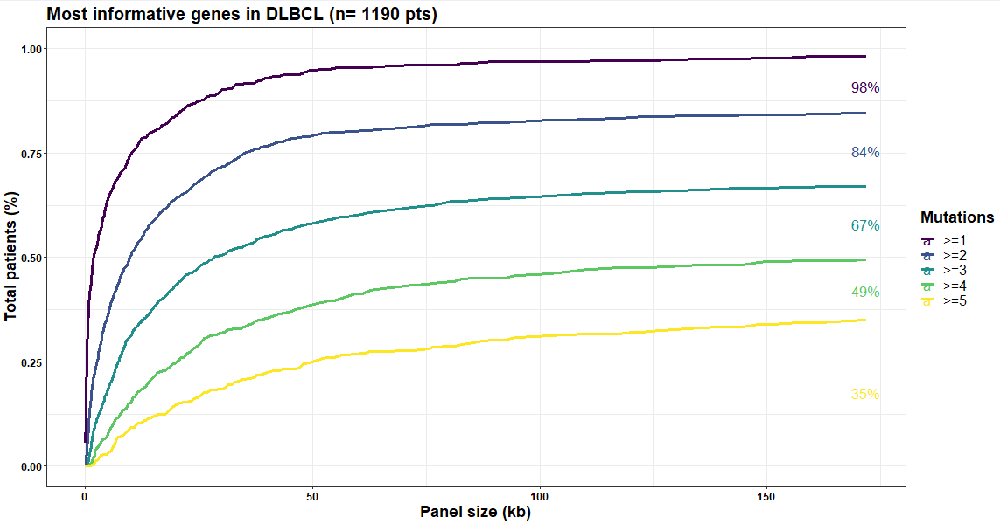
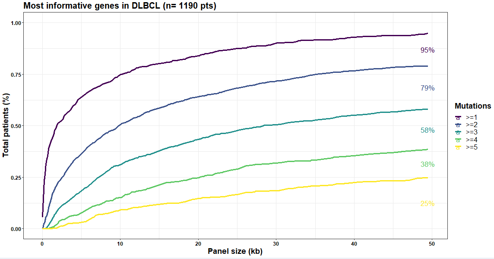
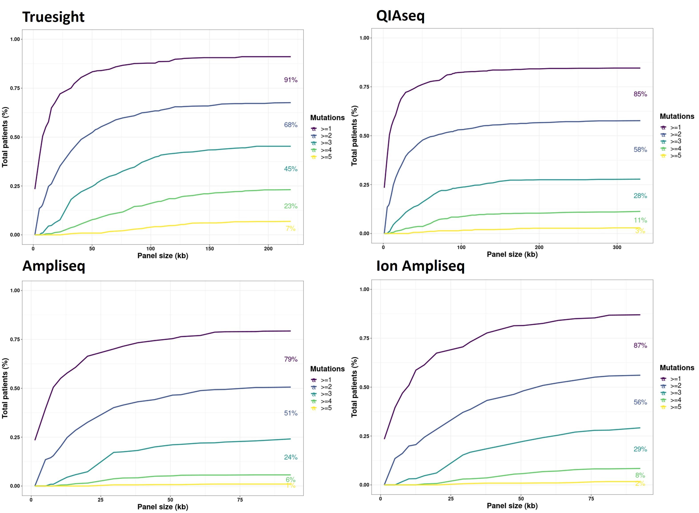

```{r setup, include = FALSE}
knitr::opts_chunk$set(
  collapse = TRUE,
  fig.align = "center",
               fig.retina = 2,
               fig.width = 10,
               cache = T,
               cache.lazy = F,
               echo = FALSE,
               message = FALSE,
               warning=FALSE,
  comment = "#>"
)

library(dplyr)

```

# Introduction 

This tutorial will guide you across the different steps to perform a panel optimization analysis using PIO. For each step, a command-line version and a GUI version will be proposed.

3 practical cases will be illustrated here:

- The establishment of an optimal panel from scratch
- The evaluation and optimization of a pre-existing custom panel  
- The benchmarking of several existing panels  

Before starting the analysis, several parameters must be selected in the left panel and will first be explained.


<br>
<br>


# Global parameters

## 1.Datasets

The training dataset can be selected here.

- **Preloaded datasets**: Here you can select mutation data from 91 independent cohorts spanning 31 different cancer types. Data sources are available in the PIO paper.

- **Custom datasets**: Custom mutation data can be uploaded by selecting browse and the correct file format. Custom datasets should contain at least the 10 following columns: "patient_id", "gene_id", "exon_id", "Chromosome", "Start_Position", "End_Position", "Strand", "Variant_Classification", "HGVSp", "cohort". Column names can differ but should be in the exact same position. Columns can be left empty in case the variable is not available (e.g. for a mutation dataset where exons have not been annotated, exon_id will be an empty column).

An example dataset is provided (Custom_dataset_example.tsv). Other example of datasets from cbioportal can be found in the raw_mutation_data folder.

Note that preloaded datasets can be merged with custom datasets to enable a global analysis on a larger base (can be done with a local use only).


## 2.Analysis parameters

### Analysis mode

Main algorithm can be selected here (see below for an illustration of each algorithm). (default: optimal)

### Group mutations by

Should mutations (and their respective length) be grouped by gene or exon/intron? (default: gene)
*/!\\ For custom panel evaluation, do not forget to select the appropriate mutation group according to your uploaded file! /!\\*

### Informativity metric

The metric used for panel optimization. PIO algorithm will rank mutations according to he number of unique patients (UP) or the number of unique patients per kilobase (UPKB). (default: UP)

### Min. patients/mutation

A minimal number of patients per mutation, calculated on the overall cohort, can be set in order to avoid overfitting to private mutations. (default: 2)

### Min. mutations/patient

How many mutations per patient you would like PIO to aim at. (default: 2)

<br>
<br>


# PIO Optimal: panel design from scratch

*Practical example: I want to design an optimal panel for Acute Myeloid Leukemia diagnosis. The panel should be defined in exons, be less than 200kb and maximize the number of patients with at least 3 mutations.*

In this situation, we will use PIO main algorithm to establish an optimal set of mutations allowing to reach an optimal informativity in the preloaded AML datasets. 


## PIO main algorithm details 

PIO main algorithm goes through different steps:

**1. Preliminary step:** Select the mutation with the highest metric in the overall cohort as the first mutation.

**2. Current step/mutation statistics** Calculate step_UP and step_UPKB, corresponding to the number of new unique patients (or new unique patient per kilobase) that are detected with the selected mutation. This step is performed on the remaining cohort (*i.e.* patients already presenting a mutation with the current panel are removed).

**3. Next Mutation selection** For this step, PIO runs two optimization module in parallel:
--> Informativity optimization: Select the mutation with the maximum selected metric in the remaining cohort (*i.e.* removing patients already presenting a mutation with the current panel)  
--> Comutation optimization: Select the mutation with the maximum selected metric among patients with at least 1 mutation but less than n mutations with the current panel in the overall cohort. (n corresponding to the min-mutation/patient parameter).

The mutation with the highest metric (either in term of new patients diagnosed or additional patients with comutation) is selected and added to the panel.

**4. Reiterate 2 & 3:** The algorithm reiterates until no more patient are added with both step 3 approaches.

## Analysis parameters & run

In this case, we will start an analysis with the following parameters:

1. Preloaded datasets:  AML 
2. Analysis mode: PIO optimal
3. Group mutations by: Exon/intron
4. Informativity metric: UPKB
5. Min. patients/mutations: 2
6. Min. mutations/patient: 3

Clicking on "run analysis" will lead you to the following results: 

### Overall graph 

The main grah shows the overall performances of the selected panel in the overall cohort (merged cohorts from the preloaded AML datasets in this case). The total number of patients (y-axis) with at least 1,2,3,4 or 5 mutations is represented according to the total panel size (in kb) on the x-axis. Graphical parameters can be tweaked using the box on the right of the graph.

```{r optimal graph 1, out.width=700}
knitr::include_graphics("vignette/1OPTIMAL_overall_graph.PNG")
```

The proposed panel of ~350kb allows to catch 79% of AML patients with at least 3 mutations, and 98% with at least 1 mutation. Using the graphical parameters, we can easily restrict the panel to 200kb, reaching 77% of patients with at least 3 mutations.

### Main panel 

Below the overall graph, you will find a downloadable table with the proposed panel and several parameters. This table can be easily downloaded and filtered to reach the desired length or explore the proposed panel. 


**- UP and UPKB** correspond to the respective informativity metric computed on the overall cohort.  
**- step_UP and step_UPKB** correspond to the respective informativity metrics computed at the corresponding step (i.e. on the remaining cohort).  
**- step_UP_comut and step_UPKB_comut** correspond to the number of unique patients or unique patients per kilobase added at the corresponding step among patients with at least 1 mutation but less than n mutations in the step panel.  
**- n_comut_n and p_comut_n** correspond to the number (or percentage) of patients with at least n mutations on the overall cohort.  
**- cum_length** corresponds to the cumulative length of the panel.


<br>


```{r optimal panel}

data_optimal <- readr::read_tsv("vignette/1Informative_merged.tsv")

data_optimal %>%
  DT::datatable(extensions = 'Buttons',
            options = list(dom = 'Blfrtip',
                           scrollX = TRUE,scrollCollapse = TRUE,
                           buttons = c('copy', 'csv', 'excel', 'pdf', 'print'),
                           lengthMenu = list(c(10,25,50,-1),
                                             c(10,25,50,"All"))))

```


### Individual cohorts

In this tab, the same analysis is performed individually for each cohort. The proposed panel can also be downloaded as a table for all cohorts, and then filtered using the "cohort" column.


### Mutation exploration

Several additional statistics can be found in the "mutation" module.

- **The "statistics" and "type & frequencies" tabs** output mutations statistics computed on the overall cohort, without considering the optimal panel.  
- **The "Distribution" tab** shows mutation co-occurence among genes or exons retained in the panel.    


<br>


# PIO custom: evaluate and optimize a panel 


*Practical example: I want to evaluate my local panel and optimize it with a set of new mutations. I am limited to 50 kb.*

In this situation, we will first use PIO in custom mode to evaluate the performances of our local panel. PIO will automatically proposes the most informative genomic intervals not included in the custom panel to add.

## PIO panel tester mode

In this mode, PIO will test the exact provided without further selection. By default, mutations are ranked according to the selected informativity metric and mutation order is defined using PIO main algorithm approach. The original mutation order can be kept as is in the local version of PIO (keep_order = T).

## Custom panel format

The custom panel must be uploaded as a simple file with a unique column containing all the mutations names (either gene or exon/intron). The file can be a tab-delimited file (.txt or .tsv) or a csv file. Once uploaded, PIO will automatically find the corresponding genomic intervals according to the NCBI Reference Sequence Database (RefSeq).


```{r custom panel format}

custom_panel <- readr::read_tsv("Custom_panel_example.tsv")
custom_panel %>%
  DT::datatable(
            options = list(dom = 'Blfrtip',
                               scrollX = TRUE,scrollCollapse = TRUE,
                           lengthMenu = list(c(10,25,50,-1),
                                             c(10,25,50,"All"))))

```


## Analysis parameters & run

After having loaded the panel, we select the following parameters:

1. Preloaded datasets:  AML 
2. Analysis mode: PIO custom
3. Group mutations by: Exon/intron (The correct format must be selected according to the loaded panel)
4. Informativity metric: UPKB
5. Min. patients/mutations: 2
6. Min. mutations/patient: 3


Before running the analysis. 

```{r overall graph 2, out.width=700}

```


Our custom panel of ~30kb allows to catch 30% of DLBCL patients with at least 3 mutations, and 84% with at least 1 mutation. Below, PIO is proposing new genomic intervals to add in order to optimize our panel. 

<br>


```{r sug_mut}

sug_mut <- readr::read_tsv("vignette/2suggested_mutations.tsv")
sug_mut %>%
  DT::datatable(
            options = list(dom = 'Blfrtip',
                               scrollX = TRUE,scrollCollapse = TRUE,
                           lengthMenu = list(c(10,25,50,-1),
                                             c(10,25,50,"All"))))

```

<br>
<br>

We can now download these suggested genomic interval to add them to our custom panel. We run back the analysis with the same parameter and our new panel:


```{r opti graph 2, out.width=700}

```


Our incremented custom panel now catches 67% of DLBCL patients with at least 3 mutations, and 98% with at least 1 mutation. This is much better but the size is now more than 150kb. We can easily reduce it to ~50kb with the graphical parameters on the right:

```{r opti 50 graph 2, out.width=700}

```


Our limited version (~50kB) of the incremented custom panel catches 58% of DLBCL patients with at least 3 mutations, and 95% with at least 1 mutation.


<br>
<br>


# Panel benchmarking


*Practical example: I have 4 different commercial panels: which one is better to reach an optimal informativity, targeting 3 different mutations per patient?*

In this situation, we will use PIO in panel tester mode to compare the performances of these 4 panels. The panels are myeloid cancer panels retrieved from Levine et al. Haematologica 2019.

## Custom panel format

The custom panel must be uploaded as a simple file with a unique column containing all the mutations names (either gene or exon/intron). The file can be a tab-delimited file (.txt or .tsv) or a csv file. Once uploaded, PIO will automatically find the corresponding genomic intervals according to the NCBI Reference Sequence Database (RefSeq).


## Analysis parameters & run

After having loaded the panel, we select the following parameters:

1. Preloaded datasets:  AML 
2. Analysis mode: Panel test
3. Group mutations by: Gene (The correct format must be selected according to the loaded panel)
4. Informativity metric: UP
5. Min. patients/mutations: 2
6. Min. mutations/patient: 3


```{r Benchmark, out.width=800}

```

